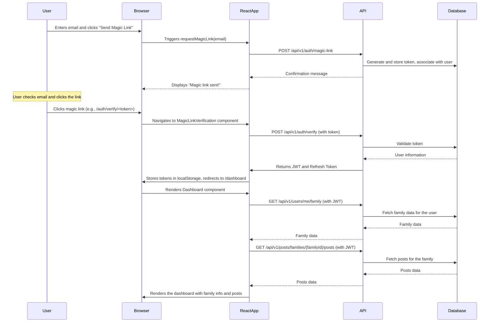

# FamilyHearth Application Documentation

This document provides a comprehensive overview of the FamilyHearth application, including its user flow, features, architecture, and potential areas for improvement.

## User Flow and Features

The FamilyHearth application is a private social media platform for families. It allows users to create a family group, share posts with text and media, and view a feed of their family's posts. The application uses a magic link authentication system for password-less login.

### 1. Landing and Initial Actions

- **Landing Page**: The user's journey begins on the landing page, which displays a welcome message and introduces the application's features. From here, the user can choose to either "Create a Family" or "Login".

### 2. Family Creation

- **Create a Family**: If the user decides to create a new family, they are taken to a form where they need to provide:
    - Family Name
    - Timezone
    - Their Name (as administrator)
    - Their Email
    - Their Phone Number
- Upon submission, the application creates the new family, authenticates the user, and redirects them to the dashboard.

### 3. User Authentication (Login)

- **Magic Link Login**: For existing users, the login process is initiated by entering their email address. The application then sends a "magic link" to their email.
- **Verification**: The user clicks the magic link in their email, which opens the application and verifies the token. Upon successful verification, the user is authenticated and redirected to their dashboard.
- **Manual Token Verification**: As an alternative, the user can manually copy a token from the email and paste it into a verification form in the application.

### 4. The Dashboard

- **Main View**: The dashboard is the central hub of the application, where users can see a feed of their family's posts.
- **Post Feed**: Posts are displayed in reverse chronological order. Each post shows the author's name, the time of posting, the text content, and any attached media.
- **Pagination**: The feed supports infinite scrolling with a "Load More" button to fetch older posts.
- **Logout**: A logout button is available to de-authenticate the user and return them to the landing page.

### 5. Post Creation

- **Create a Post**: Authenticated users can create new posts from the "/create-post" page.
- **Content**: A post can contain text and an optional file (image or video).
- **File Uploads**: The application uses a secure, pre-signed URL mechanism for file uploads, ensuring that files are uploaded directly to a storage service without exposing credentials to the client.

## Sequence Diagram

The following diagram illustrates the user flow from login to viewing the dashboard.

## Shortcomings and Room for Improvements

The application is well-structured and follows several modern web development best practices, such as JWT-based authentication with refresh tokens and pre-signed URLs for file uploads. However, there are several areas where it could be improved:

### 1. State Management

- **Current Implementation**: The application primarily relies on component-level state (`useState`, `useEffect`) and `localStorage`. While this works for the current feature set, it can become difficult to manage as the application grows in complexity. For instance, the login status is managed via a `login` event dispatched on the `window` object, which is not a standard or scalable approach.
- **Recommendation**: Introduce a proper state management library like **Redux Toolkit** or **Zustand**. This would provide a centralized store for the application's state (e.g., user authentication status, family data, posts), making it easier to manage and access from any component without prop-drilling or relying on browser events.

### 2. API Data Fetching and Caching

- **Current Implementation**: Data fetching is handled manually within `useEffect` hooks. This can lead to boilerplate code and makes it harder to manage caching, re-fetching, and loading/error states.
- **Recommendation**: Use a data fetching library like **React Query** or **SWR**. These libraries provide hooks that simplify data fetching, caching, and synchronization. They can automatically handle background re-fetching, caching strategies, and deduplicating requests, which would improve performance and user experience.

### 3. User Experience (UX)

- **Hardcoded User Name**: In `Dashboard.js`, the welcome message is hardcoded as `<h1>Welcome, [User]!</h1>`. This should be replaced with the actual user's name, which should be fetched from the API after login.
- **No Real-time Updates**: The dashboard only updates when the user manually refreshes the page or loads more posts. For a social application, real-time updates are a key feature.
- **Recommendation**:
    - Fetch the user's profile information and display their name.
    - Implement real-time updates using **WebSockets** or a service like **Pusher**. This would allow new posts to appear in the feed automatically without requiring a page reload.

### 4. Error Handling and Security

- **Error Display**: While the application has an `ErrorBoundary` component, some errors are simply logged to the console or displayed as a generic message.
- **Security**: The `jwt` is stored in `localStorage`, which is vulnerable to XSS attacks. While convenient, this is not the most secure method.
- **Recommendation**:
    - Provide more user-friendly and specific error messages.
    - For storing the JWT, consider using a more secure approach such as storing it in memory and using the refresh token (stored in an `HttpOnly` cookie for better security) to get a new JWT when the application is reloaded. This is a more complex setup but provides better security.

### 5. Component Structure and Styling

- **CSS**: The application uses separate CSS files for each component. While this is a good start, it can lead to global namespace collisions.
- **Recommendation**:
    - Adopt a more structured CSS methodology like **CSS Modules** or a CSS-in-JS library like **Styled Components** or **Emotion**. This would scope styles to individual components, preventing conflicts and making the styling more maintainable.
    - Consider using a component library like **Material-UI** or **Chakra UI** to build a more consistent and polished user interface with less effort.

By addressing these areas, the FamilyHearth application can evolve into a more robust, scalable, and user-friendly platform.
