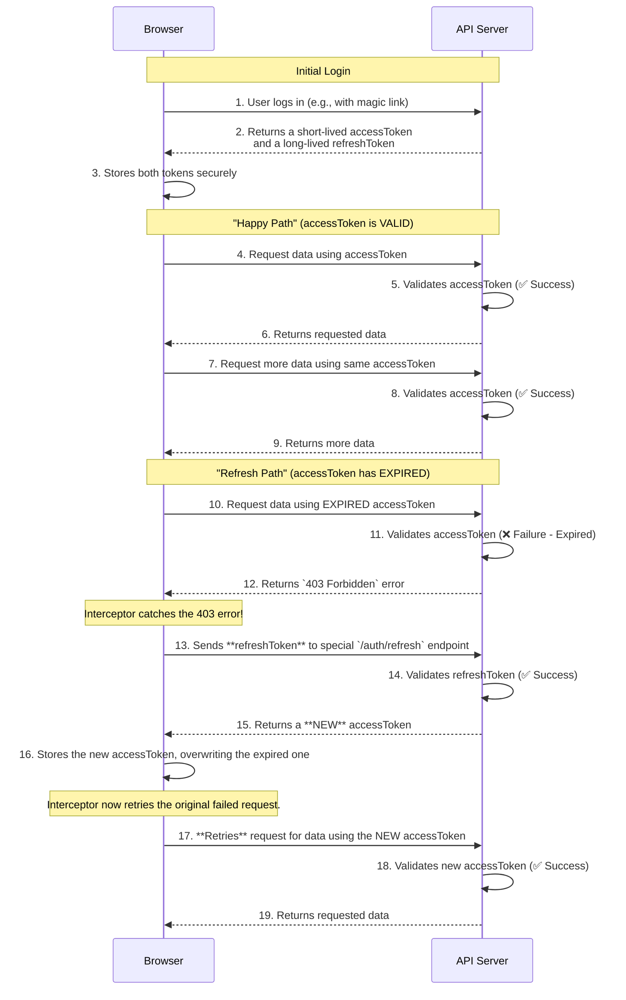

# Understanding Access token vs Refresh Token
The accessToken is used for every single API request to prove you have permission to access a resource. But because it's sent so often, it's intentionally designed to be short-lived (e.g., 30 seconds, 15 minutes). This is a security measure. If an accessToken were ever stolen, its usefulness to an attacker would be very brief.

The refreshToken is the key to a smooth user experience. It is long-lived (e.g., 7 days, 30 days) and has only one, single purpose: to securely get a new accessToken when the old one expires.

Think of it this way:

Access Token: A temporary, single-use ticket to get into a concert venue. You show it for one entry.
Refresh Token: The season pass you keep securely in your wallet. You don't show it for every entry. You only use it at the box office once your single-use ticket has been used or expires to get a new ticket for the next show.
Here is a diagram illustrating the complete flow, showing how both tokens are used.

